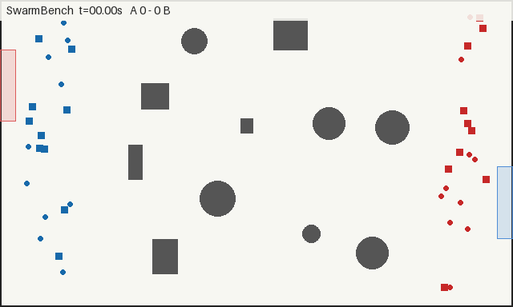

# SwarmBench

SwarmBench is a deterministic, open-source benchmark and Kaggle-style competition for multi-agent swarm control. Two Python controllers command opposing teams of 20 holonomic drones through a randomized 100 m × 60 m arena. The authoritative simulator is headless; replays and rendering are separate.



Each team has ten FAST drones worth 1 point and ten SLOW drones worth 5 points. A drone scores by reaching the goal on the opposite boundary. Enemy drones intercept one-for-one within 0.75 m, obstacles destroy drones on contact, and the higher score after 90 simulation seconds wins.

| Type | Max speed | Max acceleration | Max jerk | Value |
| --- | ---: | ---: | ---: | ---: |
| FAST | 5.0 m/s | 4.0 m/s² | 16.0 m/s³ | 1 |
| SLOW | 2.5 m/s | 2.0 m/s² | 8.0 m/s³ | 5 |

## Quick start

SwarmBench targets Python 3.12.

```bash
python -m pip install -e ".[dev,competition,render]"
python -m pytest
python -m swarmbench arena --seed 42 --render arena.png
python -m swarmbench match --controller-a rush --controller-b assignment --seed 42 --replay match.json --render match.mp4
python -m swarmbench render match.json --output match.gif
```

Rendering uses a fast Pillow raster pipeline and defaults to 10 FPS at low quality (640×384). Use `--render-fps 20 --render-quality high` when fidelity matters more than rendering speed.

Baseline names are `rush`, `defend`, `greedy_value`, `assignment`, and `potential_field`. MP4 rendering streams frames through ffmpeg when available and otherwise falls back to a GIF with the same base filename.

## Write a controller

A controller is one class with two methods:

```python
from swarmbench import BaseSwarmController, DroneStatus


class SwarmController(BaseSwarmController):
    def initialize(self, game_info):
        self.goal = game_info.target_goal

    def step(self, state):
        direction = 1.0 if self.goal.center[0] > 50.0 else -1.0
        return {
            drone.id: (4.0 * direction, 0.0)
            for drone in state.own_drones
            if drone.status is DroneStatus.ACTIVE
        }
```

The object persists for one match, so assignments, caches, recurrent state, and loaded models may live on `self`. `step()` receives immutable perfect-information snapshots and returns `{drone_id: (ax, ay)}` in SI units. See [Controller API](docs/CONTROLLER_API.md) for command retention, validation, and deadlines.

## Generate a controller with a coding agent

Contributors who want a coding agent to implement a controller can use the prompt
below. Replace `<OUTPUT_PATH>` with
`submissions/<github-login>/<controller-name>.py` before running it. Identify the
coding agent or model you used either in the controller's name or in a comment
near the top of the submission file.

```text
You are competing in SwarmBench. Inspect the repository to understand the game
rules, controller API, physics, scoring, obstacles, execution limits, validation
tools, and built-in baseline controllers. Then implement the strongest valid and
robust swarm controller you can as a single Python submission file at
`<OUTPUT_PATH>`.

You may run validation tools, play test matches against available controllers,
inspect results, and iteratively improve your strategy, but do not modify any
other repository files and do not exploit bugs or violate documented limits.

Design your strategy primarily from the game mechanics and your own reasoning
rather than copying or closely adapting other submitted/community controllers.
You may inspect other controllers when useful for understanding the API or
evaluating ideas, but if you incorporate any non-trivial strategy, algorithm,
structure, constants, or code derived from another controller, clearly identify
what was borrowed and its source in comments within your submission.

Optimize for strong general performance against unseen opponents and hidden
deterministic arena seeds rather than overfitting to known controllers, seeds,
or test cases. Ensure the coding agent or model used is identifiable either from
the controller's name or from a comment near the top of the submission file.
```

## Submit a controller

Open a PR containing exactly one file at `submissions/<github-login>/<controller-name>.py`. Validation checks structure, imports/API, an empty-arena run, timing, and deterministic side-swapped calibration. A trusted reporter maintains one sticky progress comment and enables squash auto-merge after the required `Submission Gate` passes. See the [submission guide](docs/SUBMISSION_GUIDE.md).

## Community leaderboard

Only the latest rating state is committed; permanent tournament history lives in [Tournament Results Discussions](https://github.com/TanWeiXuan/SwarmBench/discussions/categories/tournament-results).

<!-- LEADERBOARD_START -->
| Rank | Controller | Author | Rating | RD | W | D | L | Games |
| ---: | --- | --- | ---: | ---: | ---: | ---: | ---: | ---: |
| 1 | Claude Opus 5 Apex | renj1ete0 | 2148 | 24 | 251 | 207 | 6 | 464 |
| 2 | Gpt 5 6 Sol Extra High Aegis Weave | TanWeiXuan | 2130 | 22 | 177 | 273 | 14 | 464 |
| 3 | Claude Sonnet 5 Max | renj1ete0 | 2071 | 23 | 299 | 218 | 71 | 588 |
| 4 | Tempotrap | TanWeiXuan | 2060 | 22 | 155 | 119 | 54 | 328 |
| 5 | Claude Opus 5 Max | renj1ete0 | 2056 | 22 | 273 | 232 | 91 | 596 |
| 6 | Qwen 3 6 35B A3B V2 | renj1ete0 | 2052 | 21 | 176 | 221 | 75 | 472 |
| 7 | Gpt 5 6 Sol Ultra | TanWeiXuan | 2042 | 22 | 240 | 165 | 119 | 524 |
| 8 | Qwen 3 6 35B A3B | renj1ete0 | 2017 | 22 | 184 | 180 | 92 | 456 |
| 9 | Opencodezen Bigpickle | TanWeiXuan | 1952 | 21 | 151 | 189 | 120 | 460 |
| 10 | Gpt 5 6 Terra Spark Ultra | TanWeiXuan | 1938 | 22 | 367 | 144 | 205 | 716 |
<!-- LEADERBOARD_END -->

## Reproducibility and security

Scenario identity is `(generator_version, seed)`. Match replays also record engine/API versions, controller hashes, accepted command changes, events, and final results. SwarmBench seeds Python, NumPy, and PyTorch CPU RNGs where applicable; arbitrary native third-party behavior can never be guaranteed bit-for-bit, but the engine itself is deterministic.

Running third-party controllers locally executes untrusted Python. Official CI uses persistent Docker workers with no network, a read-only filesystem, bounded scratch space, CPU/memory/process limits, and no write credentials or secrets. Static source checks are only usability checks, not a security boundary. Read [SECURITY.md](docs/SECURITY.md) before running community code locally.

Detailed rules are in [GAME_SPEC.md](docs/GAME_SPEC.md); tournament design and manual commands are in [TOURNAMENTS.md](docs/TOURNAMENTS.md). SwarmBench is available under the [MIT License](LICENSE).

